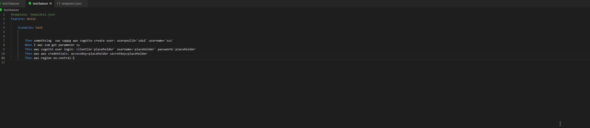
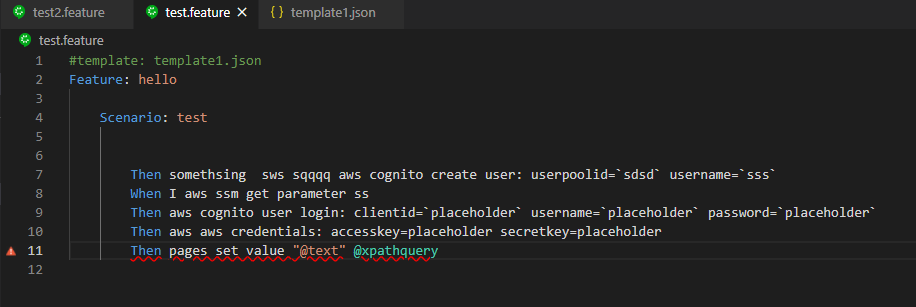
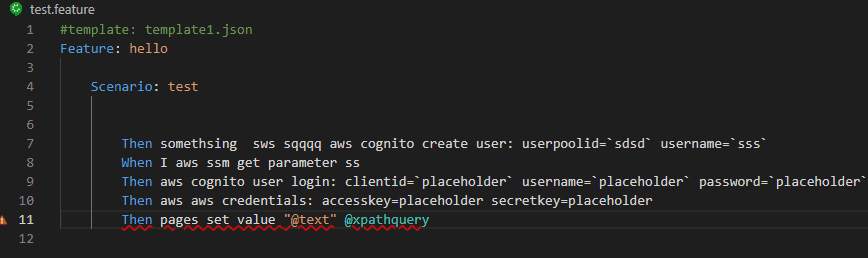
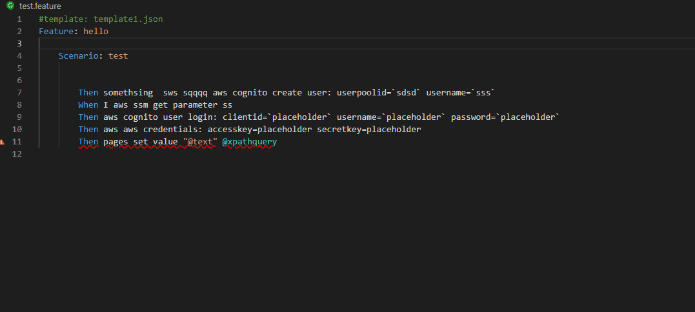
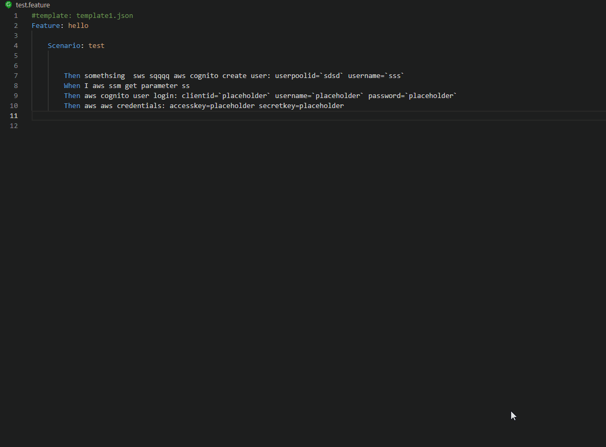
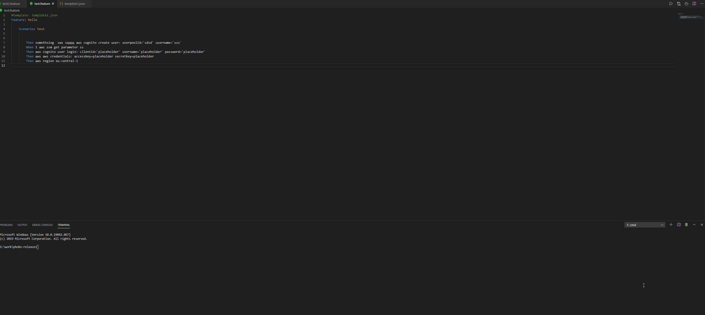
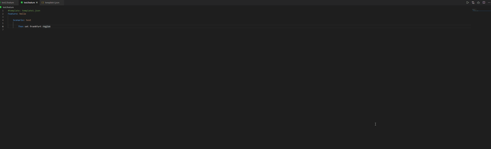

# phobo-vscode

This extension will help you write Gherkin feature files that is supported by the tool [Phobo](https://github.com/DasAng/phobo-release).

# Configuration

To configure the various settings for this extension open your user preferences and look for Phobo under extensions:

The following settings can be configured:

- **Enable validation**: If this is turned on it will validate feature files for syntax errors.
- **Executable path**: Let the extension know where the Phobo application is so that it can be used to run Phobo from within vscode. This needs to be set if you want to use the "Run Phobo" command from vscode.

# Features

- `Syntax validation`: Provides validation of Feature files
- `Run Phobo`: Enables you to run **Phobo** with the command *Run Phobo*. This requires you to have Phobo installed.
- `View translated feature files`: Allows you to view feature files that have been translated by Phobo
- `Syntax completion`: Enables completion suggestion when writing feature files.

# Syntax validation

Display any syntax errors so that you can easily spot any issues with your feature files.

Hover over the line marked with error with your mouse to see the error message:

You can also hover over the steps to see information about the action performed by the steps:

# Syntax completion

This extension will also help you with auto completion when you type in an action for your steps. For example it will provide you with a suggestion list of available actions when you are typing certain keywords:

# Run Phobo

You can run Phobo against any opened feature file by issuing the command "Run Phobo":

When you issue the "Run Phobo" command a new terminal will be created and Phobo will be executed with the current active feature file.

# View translated feature file

Phobo has a feature that allows it to translate feature files that has the "#template" comment inside the feature file. It will open the json file containing the keywords to substitute and process the feature file replacing any matching keywords.

With this extension you are able to see how the translated feature file will look like if Phobo had translated it. To do that click on the small icon as shown below and a new window will appear to the side showing you the translated feature file:

